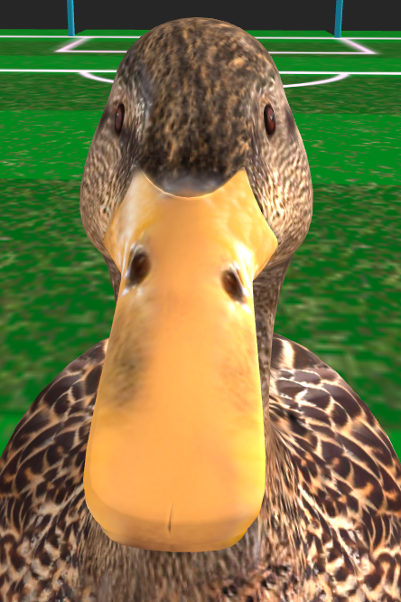

# ABCg

Development framework accompanying the course [MCTA008-17 Computer Graphics](http://professor.ufabc.edu.br/~harlen.batagelo/cg/) at [UFABC](https://www.ufabc.edu.br/).

## Original Author

Harlen Batagelo

## Student

Victor Bressani de Mello
21003415

## Pages:

1. **[Billiards](billiard/index.html) (1st activity)** ([Link direto](https://chokitus.github.io/abcg/billiard/index.html))
2. **[Pseudo Rocket League](rocketleague/index.html) (2nd activity)** ([Link direto](https://chokitus.github.io/abcg/rocketleague/index.html))
3. **[Ducket League](ducketleague/index.html) (3rd activity)** ([Link direto](https://chokitus.github.io/abcg/ducketleague/index.html))

**Devs:** Victor Bressani de Mello, 21003415

### **Atividade 1**

**Descrição:** Primeira atividade da matéria de computação gráfica. É um jogo de bilhar, de controle simples, cujo objetivo é derrubar todas as bolas.

### **Atividade 2**

**Descrição:** Segunda atividade da matéria de computação gráfica. É um bootleg do jogo Rocket League. Você dirige um carro que consegue bater na bola, e tem como objetivo fazer um gol.

### **Atividade 3**

**Descrição:** Terceira atividade da matéria de computação gráfica. É o mesmo bootleg do Rocket League usado na atividade 2, porém com a textura e formato de um pato batendo numa bola de praia. Mesmo objetivo: fazer um gol.

## License

MIT
